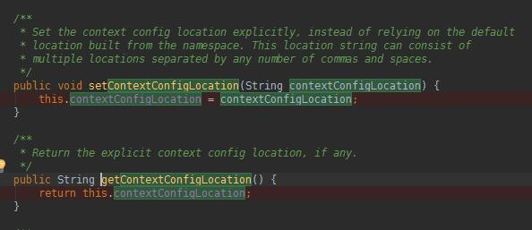
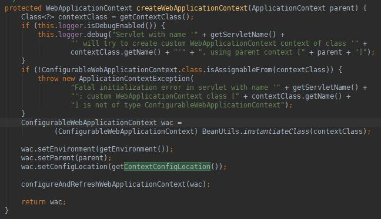

 # 简单启动SpringMVC
 
 ### 1.pom引入SpringMVC jar依赖
 ```
     <dependencies>
         <!-- Servlet API -->
         <dependency>
           <groupId>javax.servlet</groupId>
           <artifactId>javax.servlet-api</artifactId>
           <version>4.0.0</version>
           <scope>provided</scope>
         </dependency>
 
         <!-- SpringMVC依赖-包括Spring核心依赖 -->
         <dependency>
           <groupId>org.springframework</groupId>
           <artifactId>spring-webmvc</artifactId>
           <version>4.3.13.RELEASE</version>
         </dependency>
     </dependencies>
 ``` 
 
 ### 2.WEB-INF/web.xml配置
 
 **1.xml配置**
 ```
     <!-- 配置DispatcherServlet -->
     <servlet>
         <!--指定Servlet-->
         <servlet-name>springDispatcherServlet</servlet-name>
         <servlet-class>org.springframework.web.servlet.DispatcherServlet</servlet-class>
         <!-- 配置Spring MVC下的配置文件的位置和名称 -->
         <init-param>
             <param-name>contextConfigLocation</param-name>
             <param-value>classpath:spring-mvc.xml</param-value>
         </init-param>
         <load-on-startup>1</load-on-startup>
     </servlet>
 
     <!--表示Servlet拦截的请求格式 *.action表示全部拦截以.action结尾的请求-->
     <servlet-mapping>
         <servlet-name>springDispatcherServlet</servlet-name>
         <url-pattern>*.action</url-pattern>
     </servlet-mapping>
 ```
 **2.简单解释**
 ```
     1.<servlet>: 使用传统的servlet配置模式, Spring Web MVC使用单一Servlet来管理请求, 也就是DispatcherServlet
     2.<init-param>: 配置的contextConfigLocation属性, Spring使用它来启动上下文. 这里简单看一下源码
         1) 在DispatcherServlet父类FrameworkServlet中setContextConfigLocation(str)
         2) 在FrameworkServlet类createWebApplicationContext(parent)中调去Get方法初始化的Spring上下文
     3.<load-on-startup>: 当前Servlet级别
     4.<servlet-mapping>: 为Servlet映射, 表示当前Servlet处理的请求格式*.action表示以.action结尾的请求
 ```
 **3.源码**
 
 - 在DispatcherServlet父类FrameworkServlet中setContextConfigLocation(str)
 
 
 - 在FrameworkServlet类createWebApplicationContext(parent)中调去Get方法初始化的Spring上下文
 
 
 ### 3.配置SpringMVC配置文件
 
 **1.xml配置**
 
 ```
     <!-- 配置处理器映射器 将bean的name作为url进行查找，需要在配置Handler时指定bean name 为url-->
     <bean class="org.springframework.web.servlet.handler.BeanNameUrlHandlerMapping" />
 
     <!-- 配置视图解析器, 渲染页面-->
     <bean class="org.springframework.web.servlet.view.InternalResourceViewResolver">
         <!--为返回的视图名称添加前缀-->
         <property name="prefix" value="/WEB-INF/views/"></property>
         <!--为返回的视图名称添加后缀-->
         <property name="suffix" value=".jsp"></property>
     </bean>
 
     <!-- 配置适配器-->
     <bean class="org.ko.mvc.adapter.ControllerHandlerAdapter"/>
 
     <!-- 配置Controller-->
     <bean name="/hello.action" class="org.ko.mvc.controller.HelloController"/>
 ```
 ```
     1)Controller的Bean名称必须带有/, 否则SpringMVC无法映射到Controller
     2)BeanNameUrlHandlerMapping: 工程启动后会遍历筛选出Spring容器中的实例, 筛选出BeanName带/的类
     3)InternalResourceViewResolver: 会自动拼接前后綴, 渲染视图
 ```
 
 **2.实现适配器Adapter**
 
 ```
     /**
      * Controller实现类会自动适配
      */
     public class ControllerHandlerAdapter implements HandlerAdapter {
     
         /**
          * 判断是否需要适配
          * 如果对象是Controller实现类, 执行handler方法
          * @param handler
          * @return
          */
         public boolean supports(Object handler) {
             return handler instanceof Controller;
         }
     
         /**
          * Spring代理触发适配器, 下一步进入Controller
          * @param request
          * @param response
          * @param handler
          * @return
          * @throws Exception
          */
         public ModelAndView handle(HttpServletRequest request, HttpServletResponse response, Object handler) throws Exception {
             return Controller.class.cast(handler).handleRequest(request, response);
         }
     
         public long getLastModified(HttpServletRequest request, Object handler) {
             return 0;
         }
     }
 ```
 
 **3.编写HelloController继承Controller**
 
 ```
     /**
      * 执行请求的业务逻辑, 简单的传参跳转
      */
     public class HelloController implements Controller {
     
         public ModelAndView handleRequest(HttpServletRequest request, HttpServletResponse response) throws Exception {
             ModelAndView mav = new ModelAndView();
             mav.addObject("hello", "Hello, World!");
             mav.setViewName("hello");
             return mav;
         }
     }
 ```
 
 **5.启动**
 
 - 在webapp下创建index.jsp
 ```
     <html>
         <body>
             <a href="/hello">Say Hello!</a>
         </body>
     </html>
 ```
 
 **6.结束**
 